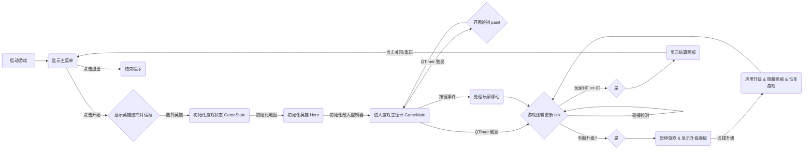

# 高级语言程序设计大作业 - “耄耋大作战”游戏实验报告

## 一. 作业题目

**基本要求：** 学生自选题目，使用C++语言完成一个图形化的小程序。
* 图形化平台不限，可以是MFC、QT等任何C++图形化平台。
* 程序内容主题不限，可以是小游戏、小工具等。

**自选题目：桌面端“幸存者”类游戏——“耄耋大作战”**

**具体描述：**
本项目旨在基于C++编程语言和Qt图形框架，开发一款名为“耄耋大作战”的桌面端“幸存者”类小游戏。玩家将操控名为“耄耋”的英雄角色，在充满挑战的地图上移动、战斗并努力生存。通过击败敌人获取经验、升级并选择强化能力，以应对愈发强大的敌人波次，体验不断变强并在绝境中求生的乐趣。

## 二. 开发软件与环境

*   **编程语言**: C++ 17
*   **图形库/框架**: Qt 6.8.1
*   **构建系统**: CMake
*   **编译器**: (例如：MinGW GCC, MSVC )
*   **IDE**: (例如：Visual Studio Code, Qt Creator)
*   **操作系统**: Windows 11

## 三. 课题要求

设计并实现一个简单的“幸存者”类游戏，玩家控制一个角色在地图上移动，角色自动攻击靠近的敌人。击败敌人会掉落经验球，拾取经验球可以升级。每次升级时，玩家可以在多个随机出现的选项中选择一项来强化角色的能力（如增加攻击力、提升移速、改变攻击方式等）。游戏的目标是在不断生成的敌人围攻下生存尽可能长的时间。

**核心要求:**

1.  **玩家控制**: 能够通过键盘控制角色上下左右移动。
2.  **自动攻击**: 角色能够自动对范围内的敌人发动攻击。
3.  **敌人系统**: 能够生成不同种类的敌人，敌人会朝玩家移动。
4.  **经验与升级**: 击败敌人获得经验，经验值达到一定程度后升级，并提供升级选项。
5.  **游戏状态**: 实现游戏开始、进行中、暂停、结束等状态。
6.  **图形界面**: 使用 Qt 实现游戏画面绘制和 UI 交互（菜单、游戏界面、升级选择、结算界面）。
7.  **多样性**: 实现至少两种不同的英雄角色，拥有不同的初始能力和升级路径。

## 四. 主要流程与功能实现

### 1. 整体流程

### 2. 功能模块实现

*   **游戏主循环 (`GameMain`)**:
    *   使用 `QTimer` 以固定间隔（例如 16ms，约 60 FPS）触发 `tick()` 函数进行游戏逻辑更新和 `update()` 函数请求界面重绘。
    *   管理游戏的核心状态（运行、暂停、结束）。
    *   处理键盘输入事件，传递给 `GameState` 和 `Hero`。
    *   负责绘制游戏场景，调用 `GameState` 的 `paint()` 方法获取所有需要绘制的对象信息 (`PaintInfo`)。
    *   集成升级面板和结算面板，直接在 `GameMain` 窗口内显示，而非弹出新窗口。

*   **游戏状态管理 (`GameState`)**:
    *   核心数据容器，包含地图 (`GameMap`)、玩家 (`Hero`)、敌人列表 (`std::vector<std::vector<Enemy*>>`)、经验球 (`std::vector<ExpBall*>`)、子弹、悬浮球等游戏对象的指针。
    *   `tick()` 方法：驱动所有游戏对象的逻辑更新（移动、AI、碰撞、生命周期管理）。
    *   `paint()` 方法：收集所有可见游戏对象的绘制信息 (`PaintInfo`) 返回给 `GameMain`。
    *   管理敌人生成逻辑（通过 `EnemyController`）。
    *   处理经验球的生成、拾取和计数。
    *   提供 `upgrade()` 接口供升级面板调用，实际调用 `Hero` 的升级方法。
    *   提供 `getHero()` 方法返回玩家对象指针。

*   **玩家角色 (`Hero`)**:
    *   处理键盘输入以更新移动状态。
    *   实现 `tick()` 方法更新位置、动画帧、武器冷却等。
    *   实现 `paint()` 方法返回自身的绘制信息（图片、位置）。
    *   根据英雄类型 (`hero_style`) 拥有不同的武器类型 (`weapon_type`) 和外观（GIF 动画）。
    *   **哈气耄耋 (AOE)**: 定期创建范围伤害区域 (`HeroStaticBullet`)。升级主要提升范围和伤害。
    *   **奔跑耄耋 (悬浮球/追踪弹)**: 拥有环绕自身的 `FloatingOrb` 进行持续伤害，并能发射 `HeroDynamicBullet` 追踪敌人。升级主要提升悬浮球转速/数量或追踪弹性能。
    *   管理生命值、经验值、等级、速度、伤害减免、攻击力、冷却时间等属性。
    *   `upgrade(int type)`: 根据选择的升级类型修改自身属性或武器状态。
    *   `getUpgradeOptions()`: 根据当前状态和英雄类型，生成包含描述和图标路径的升级选项列表 (`QVector<QPair<QString, QString>>`)。
    *   `judgeDamage()`: 判断自身是否受到敌人伤害。

*   **敌人 (`Enemy`, `EnemyController`)**:
    *   `Enemy`: 基类，定义敌人通用属性（HP、速度、伤害）和行为（移动、受击、死亡掉落经验）。派生出不同类型的敌人。
    *   `EnemyController`: 根据游戏阶段 (`stage`) 和配置信息 (`STAGE_INFOS`) 控制敌人的生成时间和数量，维护当前活跃的敌人。

*   **武器系统**:
    *   `HeroStaticBullet`: AOE 伤害区域，有持续时间。
    *   `FloatingOrb`: 环绕英雄旋转的球体，对碰撞到的敌人造成伤害。
    *   `HeroDynamicBullet`: 发射后追踪特定敌人的子弹。

*   **经验球 (`ExpBall`)**:
    *   敌人死亡时在原地生成。
    *   玩家靠近时被吸收，增加玩家经验值。
    *   有生命周期，超时未被拾取会消失。

*   **UI 界面**:
    *   **主菜单 (`Menu`)**: 提供开始游戏、退出等选项。
    *   **英雄选择 (`HeroSelectDialog`)**: 使用 `QDialog` 实现，包含两个 `QLabel` (使用 `QMovie` 显示 GIF)、描述文本和选择按钮。通过信号槽将选择结果传递给 `Menu`。
    *   **游戏界面 (`GameMain`)**:
        *   使用 `paintEvent` 绘制游戏场景。
        *   包含状态显示标签（HP, Level, EXP, Timer等）。
        *   内嵌升级面板 (`upgrade_widget`) 和结算面板 (`game_over_widget`)，根据游戏状态显示/隐藏。
        *   升级面板按钮动态生成，根据 `Hero::getUpgradeOptions()` 设置文字和图标。
    *   **资源管理 (`gameres.qrc`)**: 使用 Qt 资源文件管理图片 (`.png`, `.gif`) 和可能的音频文件。

*   **背景音乐 (`QMediaPlayer`)**:
    *   在 `GameMain` 中初始化 `QMediaPlayer` 和 `QAudioOutput`。
    *   尝试加载 BGM 文件（优先使用资源路径，失败则尝试绝对路径）。
    *   设置循环播放。
    *   包含错误处理和状态检查逻辑。

## 五. 关键技术与算法

*   **面向对象设计 (OOP)**: 将游戏世界中的实体（玩家、敌人、子弹、经验球、地图）抽象为 C++ 类，利用封装、继承（如 Enemy 基类）和多态来组织代码，提高可维护性和扩展性。
*   **状态模式 (Implicit)**: `GameMain` 和 `GameState` 共同维护游戏的不同状态（菜单、选择英雄、游戏中、暂停、升级中、结束），并根据状态执行不同的逻辑和渲染。
*   **事件驱动编程**: 大量使用 Qt 的信号与槽机制进行解耦：
    *   按钮点击 (`QPushButton::clicked`) 连接到处理函数。
    *   定时器超时 (`QTimer::timeout`) 连接到 `tick()` 和 `update()`。
    *   `HeroSelectDialog` 发射 `heroSelected(int)` 信号通知 `Menu`。
*   **Qt 图形视图框架 (Alternative)**: 虽然本项目未使用，但 Qt Graphics View Framework 是更适合复杂 2D 游戏场景管理的框架。本项目直接在 `QWidget::paintEvent` 中绘制，适合规模较小的场景。
*   **资源管理**: 使用 `.qrc` 文件将图片、音频等资源编译到可执行文件中，简化部署和路径管理。使用 `:/` 前缀访问资源。
*   **碰撞检测**:
    *   **玩家 vs 敌人**: 简单的矩形碰撞检测或基于距离的检测。
    *   **武器 vs 敌人**:
        *   AOE: 检测敌人中心点是否在伤害圆/矩形内。
        *   悬浮球: 检测悬浮球与敌人矩形的碰撞。
        *   追踪子弹: 检测子弹与目标敌人的碰撞。
    *   **玩家 vs 经验球**: 检测玩家吸收范围（圆形）是否与经验球碰撞。
*   **异步/延迟执行**: 使用 `QTimer::singleShot(0, ...)` 将耗时或可能阻塞事件循环的操作（如 `resumeGame` 中的多个 UI 更新和逻辑触发、升级后的恢复操作、`deleteLater()` 的调用）分解到事件循环的后续轮次执行，避免界面卡顿和逻辑冲突。
*   **多媒体处理**:
    *   `QMediaPlayer` + `QAudioOutput` 用于播放背景音乐，需要处理加载、播放、循环、错误等状态。
    *   `QMovie` 用于在 `QLabel` 或直接绘制时显示 GIF 动画（英雄选择界面、游戏内英雄）。
*   **CMake 构建**: 使用 CMake 管理项目编译、链接依赖（如 Qt 模块、`winmm` 库）、包含头文件和源文件列表。

## 六. 遇到的问题与解决方案

1.  **问题：升级时游戏卡死**
    *   **现象**: 点击升级选项后，游戏界面冻结，无法继续。
    *   **分析**: 初步怀疑是升级逻辑阻塞了 Qt 的事件循环。早期代码在 `UpgradeDialog` 的按钮槽函数中直接调用 `game->upgrade()`、`game->resumeGame()` 并 `delete this;`。`delete this;` 立即销毁对话框实例，可能导致后续代码访问无效内存。即使改为 `deleteLater()`，密集的逻辑和 UI 更新调用也可能在单次事件处理中耗时过长。
    *   **解决方案**:
        1.  将 `delete this;` 改为 `deleteLater();`，确保对象在事件循环空闲时安全删除。
        2.  将升级面板集成到 `GameMain` 中，避免 `QDialog` 的模态问题。
        3.  使用 `QTimer::singleShot(0, ...)` 将 `upgrade()`、`resumeGame()` 以及面板的隐藏操作分别放入事件队列中延迟执行，分解耗时操作，避免阻塞。重构 `resumeGame` 函数，将其内部的多个步骤也用 `singleShot` 分开执行。

2.  **问题：背景音乐 (BGM) 无法播放**
    *   **现象**: 游戏运行但听不到背景音乐。
    *   **分析**:
        *   检查 `QMediaPlayer` 状态和错误信号，发现有时是资源路径问题 (`:/` vs 文件系统路径)。
        *   确认音频文件格式受支持 (如 MP3, WAV)。
        *   检查 `QAudioOutput` 是否正确初始化。
        *   怀疑是平台相关的多媒体后端问题。在 Windows 上，Qt 的多媒体功能可能依赖底层的 DirectShow 或 Media Foundation，需要链接相应的系统库。
    *   **解决方案**:
        1.  添加详细的日志记录 `QMediaPlayer` 的 `errorOccurred` 信号和 `mediaStatusChanged` 信号，打印错误信息和状态变化。
        2.  尝试使用绝对路径加载音频文件，排除资源系统问题。
        3.  确保 `QAudioOutput` 被正确设置给 `QMediaPlayer`。
        4.  修改 `CMakeLists.txt`，在 `target_link_libraries` 中为 Windows 平台添加 `winmm.lib` (Windows MultiMedia API)，解决链接器找不到 `mciSendStringW` 等函数的错误。

3.  **问题：编译链接错误频发**
    *   **现象**: 在添加新类、修改头文件或 CMake 文件后，出现各种编译或链接错误。
    *   **分析**:
        *   **链接器找不到类定义**: 通常是因为新的 `.cpp` 文件没有添加到 `CMakeLists.txt` 的源文件列表 (`add_executable` 或 `target_sources`) 中，或者对应的 `.h` 文件没有被正确包含。
        *   **头文件找不到**: `include` 路径配置问题，或头文件本身放错了位置。
        *   **函数声明与定义不匹配**: `.h` 文件中的函数签名与 `.cpp` 文件中的实现不一致（参数类型、数量、`const` 修饰符等）。
        *   **类型不完整 (Incomplete Type)**: 在头文件中只前置声明了某个类 (`class MyClass;`)，但在需要知道该类大小或访问其成员的地方（如创建对象实例、直接使用成员）没有包含完整的类定义头文件。
        *   **使用了已弃用的类**: 如 `QSound` 在 Qt 6 中被标记为弃用。
    *   **解决方案**:
        1.  **仔细检查 `CMakeLists.txt`**: 确保所有 `.cpp` 文件都已添加，`target_include_directories` 设置正确。
        2.  **头文件包含**: 使用 `#include` 包含必要的头文件。对于只需要指针或引用的情况，优先使用前置声明 (`class MyClass;`) 以减少编译依赖；但在需要完整定义的地方必须 `#include`。
        3.  **核对函数签名**: 确保 `.h` 和 `.cpp` 中的函数声明和定义完全一致。
        4.  **替换弃用类**: 查找 Qt 文档，使用推荐的替代类（如用 `QMediaPlayer` 替代 `QSound`）。
        5.  **逐一解决**: 耐心阅读编译器的错误信息，定位问题代码行，根据错误类型进行修复。

4.  **问题：特定升级图标 (`gongji.png`) 无法显示**
    *   **现象**: 其他升级图标 (`shengming.png`, `sudu.png`) 正常显示，但攻击力图标不显示。
    *   **分析**:
        *   在 `GameMain::showUpgradePanel` 中添加调试日志，打印 `Hero::getUpgradeOptions()` 返回的图标路径。确认路径字符串 `":/Assets/gongji.png"` 是正确的。
        *   检查 `QIcon(iconPath).isNull()`，发现对于 `gongji.png` 的路径，加载后的 `QIcon` 对象是空的，表明 Qt 资源系统无法成功加载该特定图片资源。
        *   排查文件名大小写、`.qrc` 文件中该资源的条目是否正确、图片文件本身是否有效（尝试用图片查看器打开）。
    *   **解决方案 (临时)**: 在 `Hero.cpp` 的 `getUpgradeOptions` 中，暂时将返回的攻击力图标路径替换为另一个已知有效的图标路径（如 `:/Assets/sudu.png`），以确保功能可用。
    *   **根本原因待查**: 需要进一步检查 `gongji.png` 文件本身是否有损坏、格式是否不被 Qt 支持（可能性较低）、或者 `.qrc` 文件编译过程中是否存在问题。可以尝试重新添加资源、清理并重新构建项目。

## 七. 测试

*   **单元测试 (模拟)**: 虽然没有使用正式的单元测试框架，但在开发过程中对关键类和函数进行了隔离测试和日志输出验证，例如：
    *   测试 `GameState` 能否正确添加和移除敌人/经验球。
    *   测试 `Hero` 的移动、属性修改、升级逻辑是否符合预期。
    *   测试碰撞检测算法的准确性。
*   **集成测试**: 运行整个游戏，测试各模块组合后的功能：
    *   英雄选择是否正确影响初始状态和后续升级。
    *   游戏流程是否顺畅（开始、游戏、升级、结束）。
    *   UI 元素是否按预期显示和交互。
    *   背景音乐和音效是否播放。
*   **调试手段**:
    *   大量使用 `qDebug()` 和 `std::cout` 输出关键变量值和函数执行流程日志。
    *   使用 IDE 的断点调试功能，单步跟踪代码执行，检查变量状态。
    *   利用 Qt Creator 的调试器查看对象属性和信号槽连接。

## 八. 收获与总结

通过本次大作业，我获得了以下收获：

1.  **深入理解了 Qt 框架**: 对 Qt 的核心机制，如事件循环、信号与槽、绘图系统 (`QPainter`, `paintEvent`)、资源管理 (`.qrc`)、多媒体 (`QMediaPlayer`, `QMovie`) 以及常用控件 (`QWidget`, `QPushButton`, `QLabel` 等) 有了更深入的理解和实践经验。
2.  **掌握了 C++ 游戏开发基础**: 学习了如何运用面向对象思想设计游戏实体类，管理游戏状态，实现基本的游戏逻辑（移动、碰撞、AI、升级系统）。
3.  **熟悉了 CMake 构建系统**: 掌握了使用 CMake 配置 C++ 项目、管理依赖项（特别是 Qt 库）、处理平台特定链接（如 Windows 的 `winmm`）的基本方法。
4.  **提升了调试能力**: 在解决升级卡死、BGM 不播放、编译链接错误等复杂问题时，学会了通过日志分析、断点调试、隔离问题等方法定位和修复 Bug，提升了调试复杂程序的能力。
5.  **理解了 Qt 对象生命周期管理**: 深刻理解了 `delete` 与 `deleteLater()` 的区别及其在事件驱动环境下的重要性，认识到直接 `delete this` 可能引发的风险。
6.  **认识到跨平台和依赖问题**: BGM 问题突显了在不同平台上进行多媒体编程时可能遇到的库依赖和后端差异问题。
7.  **实践了 UI 与逻辑分离**: 虽然本项目中 UI 和逻辑耦合度可能仍然较高，但通过 `GameState` 和 `GameMain` 的划分，以及将 UI 面板集成到主窗口中，尝试进行了初步的 UI 与逻辑分离实践。

**总结**: 本项目成功实现了一个具有基本玩法的“幸存者”类游戏，涵盖了图形界面、事件处理、游戏逻辑、资源管理等多个方面。开发过程充满挑战，但也极大地锻炼了我的 C++ 编程能力、Qt 应用能力和问题解决能力。虽然仍有一些待完善之处（如更精细的碰撞检测、更丰富的敌人 AI 和升级选项、性能优化等），但基本达到了预期的目标。
